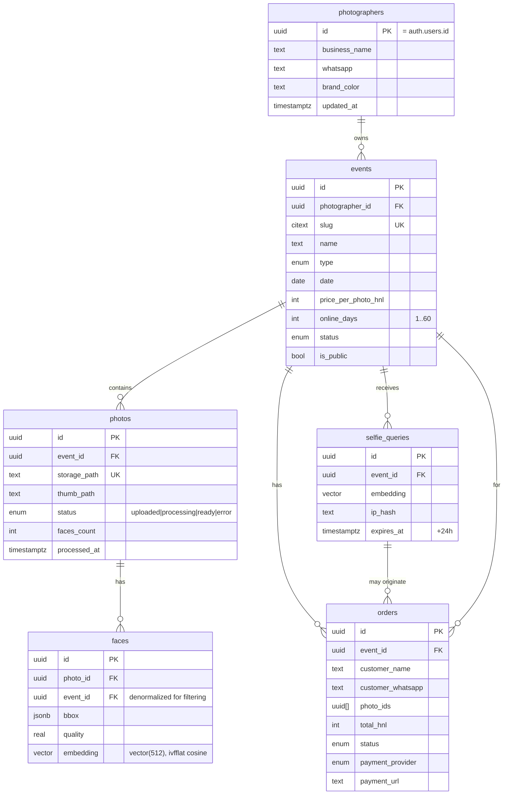
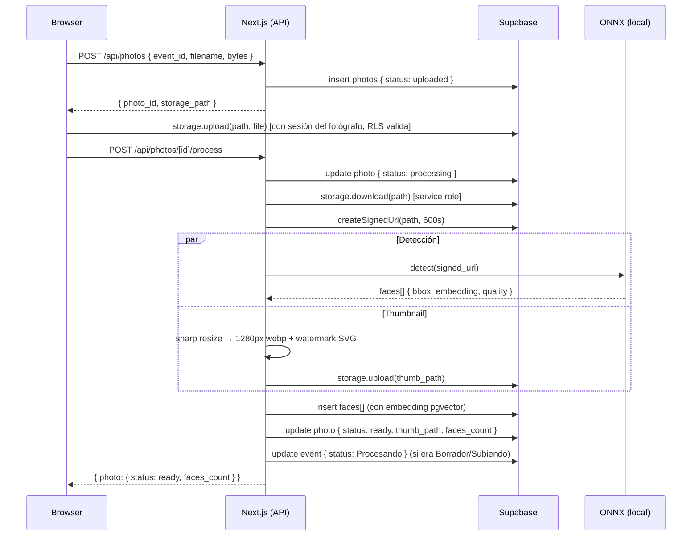
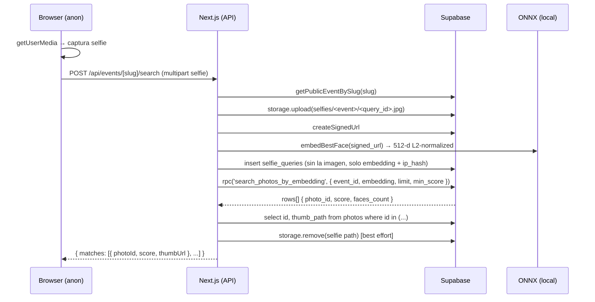
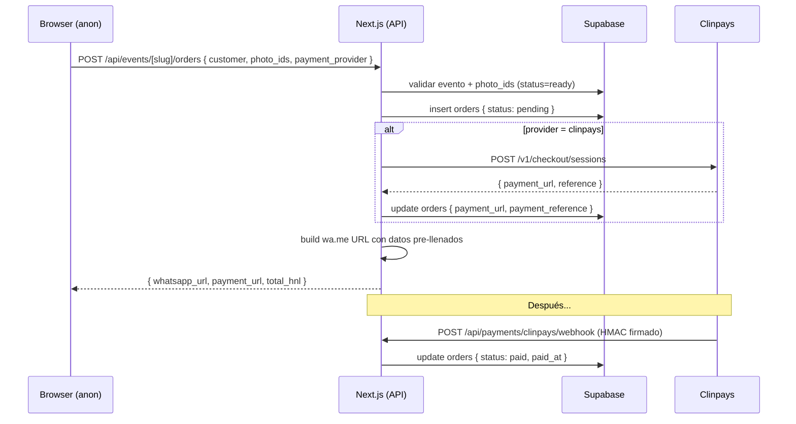

# Arquitectura

> Última revisión: 2026-05. Este documento describe cómo está construida 4tercios y por qué se tomaron las decisiones que se tomaron.

## Resumen en 30 segundos

Plataforma para fotógrafos de eventos en Honduras. El fotógrafo sube fotos, una IA detecta rostros y genera embeddings vectoriales. Los asistentes al evento toman una selfie y la app les muestra las fotos donde aparecen, con un score de confianza. Pueden comprarlas vía WhatsApp o Clinpays.

Todo corre como una sola app Next.js + Supabase. **Sin servidor Python, sin colas, sin servicios externos pagos**: el reconocimiento facial corre on-server con `onnxruntime-node` usando modelos InsightFace open-source.

```
┌─────────────────┐     ┌──────────────────────────────────┐     ┌─────────────────┐
│   Fotógrafo     │     │      Next.js 16 + React 19       │     │    Supabase     │
│ (autenticado)   │◄───►│  ┌──────────────────────────────┐│◄───►│  Postgres       │
│                 │     │  │ Server: route handlers,      ││     │  + pgvector     │
│ Asistente       │     │  │ server actions, server comps ││     │  + Auth         │
│ (anónimo)       │     │  └──────────────────────────────┘│     │  + Storage      │
└─────────────────┘     │  ┌──────────────────────────────┐│     └─────────────────┘
                        │  │ Client: drag&drop, webcam,   ││
                        │  │ galería, checkout            ││
                        │  └──────────────────────────────┘│
                        │  ┌──────────────────────────────┐│
                        │  │ ONNX runtime (InsightFace)   ││
                        │  │ + sharp (thumbs)             ││
                        │  └──────────────────────────────┘│
                        └──────────────────────────────────┘
```

## Stack

| Capa                  | Tecnología                                           | Por qué                                                                                                |
| --------------------- | ---------------------------------------------------- | ------------------------------------------------------------------------------------------------------ |
| Frontend + servidor   | Next.js 16 (App Router) + React 19                   | Una sola app — server components para data, client components para interactividad. Turbopack dev/prod. |
| DB                    | Supabase Postgres + `pgvector`                       | Embeddings nativos, búsqueda ANN con índice IVFFlat. Sin un vector DB aparte.                          |
| Auth                  | Supabase Auth (cookies + SSR)                        | OAuth Google + email/password. Cookie-aware client en server components.                               |
| Storage               | Supabase Storage                                     | 3 buckets con RLS: originales privados, thumbs públicos, selfies privadas y efímeras.                  |
| Reconocimiento facial | InsightFace (SCRFD + ArcFace) vía `onnxruntime-node` | Modelos públicos del mirror `immich-app/buffalo_s`. Corre en CPU del servidor. **$0 por inferencia**.  |
| Imágenes              | `sharp`                                              | Thumbnails 1280px webp con watermark SVG compositado.                                                  |
| UI                    | Tailwind v4 + Radix UI                               | shadcn-style components ya en `src/components/ui/`.                                                    |
| Pagos                 | Clinpays (Honduras)                                  | Adapter detrás de interface. WhatsApp manual como fallback.                                            |
| Mapa de evento        | Leaflet + OpenStreetMap                              | Picker de ubicación + reverse geocoding via Nominatim.                                                 |

## Estructura del repo

```
src/
├── app/                            App Router routes
│   ├── api/                        Route handlers (REST)
│   │   ├── photos/                   POST registrar | POST process
│   │   ├── events/[slug]/search/     POST búsqueda por selfie
│   │   ├── events/[slug]/orders/     POST crear orden
│   │   ├── geocode/reverse/          GET reverse geocode
│   │   └── payments/clinpays/        POST webhook
│   ├── dashboard/                  Área del fotógrafo (auth required)
│   │   ├── page.tsx                 Home con KPIs + listas recientes
│   │   ├── events/                  CRUD de eventos
│   │   │   ├── new/                  Crear (server action)
│   │   │   └── [eventId]/
│   │   │       ├── upload/           Drag & drop + processing
│   │   │       └── edit/             Editar / borrar
│   │   ├── orders/                  Lista + detalle de órdenes
│   │   └── settings/                 Perfil, marca, pagos, notificaciones
│   ├── e/[slug]/                   Galería pública por slug
│   │   ├── page.tsx                 Captura de selfie + búsqueda
│   │   └── results/                 Galería completa con selección
│   ├── auth/, login/, registro/    Flujo de autenticación
│   └── onboarding/                 First-run wizard del fotógrafo
├── components/
│   ├── ui/                         Primitivas (Button, Card, Dialog…)
│   ├── shell/                      Topbar + Sidebar
│   ├── search/                     Selfie capture, gallery, results
│   ├── upload/                     Drag & drop con concurrencia
│   └── forms/                      DatePicker, LocationPicker (Leaflet)
├── lib/
│   ├── supabase/                   Browser / server / service-role clients
│   ├── server/                     Capa de datos (server-only)
│   │   ├── auth.ts                   requirePhotographer + bootstrap row
│   │   ├── events.ts                 list/get/create/update/delete + stats
│   │   ├── photos.ts                 register + process pipeline
│   │   ├── orders.ts                 create + status transitions
│   │   └── search.ts                 selfie embedding + pgvector RPC
│   ├── face/                       Reconocimiento facial
│   │   ├── index.ts                  Provider selection
│   │   ├── types.ts                  FaceProvider interface
│   │   ├── local-provider.ts         Default: ONNX local
│   │   ├── replicate-provider.ts     Alternativa GPU remota
│   │   ├── mock-provider.ts          Tests / dev sin descarga
│   │   └── local/                    Pipeline ONNX
│   │       ├── models.ts              Lazy download + ort sessions
│   │       ├── preprocess.ts          sharp decode + letterbox + CHW
│   │       ├── detector.ts            SCRFD post-processing + NMS
│   │       ├── aligner.ts             Umeyama transform + warp afín
│   │       └── recognizer.ts          ArcFace + L2 normalize
│   ├── imaging/thumb.ts            sharp watermark + 1280px webp
│   ├── payments/clinpays.ts        Adapter de Clinpays + wa.me builder
│   ├── storage/paths.ts            Convenciones de paths en Storage
│   ├── upload/concurrency.ts       Pool con concurrency=4
│   ├── db/types.ts                 Shapes de filas (en sync con SQL)
│   └── local-store.tsx             [legacy] localStorage para settings UI
├── middleware.ts                   Limpia params de error de OAuth
└── ...

supabase/migrations/
├── 0001_initial_schema.sql         Tablas + pgvector + RLS + RPC
├── 0002_storage.sql                Buckets + storage policies
└── 0003_retention.sql              CHECK 60 días + auto-archive cron
```

## Modelo de datos



### Decisiones del schema

- **Embeddings 512-d con `pgvector`**: ArcFace estándar. Modelos que retornan menos dims (128, 192) se padean con ceros — la similitud coseno se preserva porque tras L2-normalizar la magnitud queda en 1 y los ceros aportan 0 al producto punto.
- **`event_id` denormalizado en `faces`**: para filtrar por evento sin joinear. La búsqueda ANN es `WHERE event_id = $1` + cosine ranking.
- **IVFFlat con `lists=100`**: tuneado para ~50k rows. Recreate con `lists ≈ sqrt(rows)` cuando crezca.
- **Slug como `citext`** con UNIQUE: comparaciones case-insensitive sin lower() en cada query.
- **`online_days` constraint 1..60**: prevenir blowup de storage. Enforced en DB, server action, y cliente.

### RPC: `search_photos_by_embedding`

Una sola query agrega por foto el mejor score de cualquiera de sus caras:

```sql
select
  f.photo_id,
  max(1 - (f.embedding <=> p_embedding))::real as score,
  count(*)::int as faces_count
from public.faces f
where f.event_id = p_event_id
group by f.photo_id
having max(1 - (f.embedding <=> p_embedding)) >= p_min_score
order by score desc
limit p_limit;
```

Una foto con varias personas siendo tú-y-amigos rankea por la cara que más se parezca, no se duplica el resultado.

## Row-Level Security

Toda tabla con RLS habilitado. Reglas clave:

| Tabla                           | Policy                                                    | Quién                         |
| ------------------------------- | --------------------------------------------------------- | ----------------------------- |
| `events`                        | `photographer_id = auth.uid()` (ALL)                      | Fotógrafo dueño               |
| `events`                        | `is_public AND status IN ('Procesando','Listo')` (SELECT) | Anon (página pública)         |
| `photos`                        | dueño del evento (ALL)                                    | Fotógrafo                     |
| `photos`                        | `status='ready'` y evento público (SELECT)                | Anon                          |
| `faces`                         | dueño del evento (SELECT)                                 | Fotógrafo (lectura analítica) |
| `selfie_queries`                | dueño del evento (SELECT)                                 | Fotógrafo                     |
| `orders`                        | dueño del evento (ALL)                                    | Fotógrafo                     |
| `orders` (INSERT desde anónimo) | bypass via service role                                   | Server route handler          |

Las inserciones desde clientes anónimos (crear orden, registrar selfie query) **siempre pasan por el service role en el server**. La browser session anónima nunca toca la DB directamente para esto.

## Convenciones de Storage

```
photos-original/<event_id>/<photo_id>.<ext>     [private]  signed URLs solamente
photo-thumbs/<event_id>/<photo_id>.webp         [public]   1280px watermarked
selfies/<event_id>/<query_id>.jpg               [private]  borrado tras búsqueda
```

Las storage policies extraen el `event_id` de la primera carpeta del path:

```sql
exists (
  select 1 from public.events e
  where e.id::text = (storage.foldername(name))[1]
    and e.photographer_id = auth.uid()
)
```

Eso permite al fotógrafo subir directo desde el browser con su sesión sin firmar URLs por cada foto.

## Flujos

### Subida de foto (fotógrafo)



Concurrencia cliente: 4 fotos en paralelo (`runWithConcurrency`). Si el browser cierra a media subida, las fotos en `uploaded`/`processing` quedan reclamables (UI muestra "Reprocesar" — pendiente de wire up).

### Búsqueda por selfie (asistente)



La selfie cruda nunca se persiste más allá del request. Solo el embedding queda en `selfie_queries`, y ese tiene `expires_at = now() + 24h`.

### Crear orden



## Reconocimiento facial — provider local

Es la pieza más densa. La pipeline:

```
JPEG/PNG/HEIC bytes
        │
        ▼
┌─────────────────────────────────────────────────┐
│  sharp.decode → RGB raw (uint8)                 │
└──────────────────┬──────────────────────────────┘
                   ▼
┌─────────────────────────────────────────────────┐
│  letterbox a 640×640 (escala uniforme)          │
│  CHW float32 normalizado: (x - 127.5) / 128     │
└──────────────────┬──────────────────────────────┘
                   ▼
┌─────────────────────────────────────────────────┐
│  SCRFD ONNX (2.5MB)                             │
│  9 outputs × 3 strides (8/16/32):               │
│   - scores [N×1]                                │
│   - bbox preds [N×4] (distance from anchor)     │
│   - kps preds  [N×10] (5 puntos × 2)            │
└──────────────────┬──────────────────────────────┘
                   ▼
┌─────────────────────────────────────────────────┐
│  Decode anchors → bbox y kps en pixel space     │
│  threshold 0.5 + NMS IoU 0.4                    │
└──────────────────┬──────────────────────────────┘
                   ▼ por cada cara superviviente
┌─────────────────────────────────────────────────┐
│  Umeyama similarity transform (5 kps → ref)    │
│  warp afín bilineal a 112×112 RGB              │
└──────────────────┬──────────────────────────────┘
                   ▼
┌─────────────────────────────────────────────────┐
│  ArcFace ONNX (13.6MB)                          │
│  Input: 1×3×112×112 normalizado (x-127.5)/127.5 │
│  Output: 512-d embedding                        │
└──────────────────┬──────────────────────────────┘
                   ▼
┌─────────────────────────────────────────────────┐
│  L2 normalize → cosine similarity = dot product │
└─────────────────────────────────────────────────┘
```

### Decisiones clave del provider local

- **Por qué `onnxruntime-node`**: bindings nativos prebuilds para darwin-arm64 + linux-x64 (no necesita compilar). `tfjs-node` falla seguido en Apple Silicon.
- **Por qué buffalo_s y no buffalo_l**: 16MB total vs 280MB. Accuracy diferencia: ~1% en LFW. No vale la pena el peso.
- **Mirror `immich-app`**: es el proyecto Immich (foto self-hosted), mantiene este mirror estable porque lo usan en producción para su propia búsqueda facial.
- **Sin alineación de cara → -10% accuracy**: por eso implementé Umeyama + warp afín completo. Es ~150 líneas de código pero crítico para que ArcFace funcione bien.
- **Padding a 512-d cuando el modelo retorna menos**: `cos(a, b) = a·b` tras L2 norm. Padding con 0s no afecta el producto.

### Cuándo cambiar a Replicate

Si llegamos a >1000 fotos/min sostenidas, el provider local saturará el CPU del runtime de Vercel. Switch:

```bash
FACE_PROVIDER=replicate
REPLICATE_API_TOKEN=r8_xxx
REPLICATE_FACE_MODEL=tu_usuario/4tercios-faces  # cog-deployed con InsightFace
```

El parser de `replicate-provider.ts` acepta múltiples shapes de output comunes.

## Variables de entorno

| Variable                        | Default                        | Notas                                                        |
| ------------------------------- | ------------------------------ | ------------------------------------------------------------ |
| `NEXT_PUBLIC_SUPABASE_URL`      | —                              | Requerido                                                    |
| `NEXT_PUBLIC_SUPABASE_ANON_KEY` | —                              | Requerido                                                    |
| `SUPABASE_SERVICE_ROLE_KEY`     | —                              | Requerido. **Server-only**, jamás expuesto al cliente        |
| `FACE_PROVIDER`                 | auto                           | `local` \| `replicate` \| `mock`                             |
| `FACE_MODELS_DIR`               | `$TMPDIR/4tercios-face-models` | Cache de los ONNX                                            |
| `FACE_DETECTION_URL`            | HF mirror                      | Override del modelo de detección                             |
| `FACE_RECOGNITION_URL`          | HF mirror                      | Override del modelo de embedding                             |
| `SELFIE_MIN_SCORE`              | `0.45`                         | Cosine score mínimo para mostrar match                       |
| `REPLICATE_API_TOKEN`           | —                              | Solo si usamos Replicate                                       |
| `REPLICATE_FACE_MODEL`          | —                              | `owner/name[:version]`                                       |
| `REPLICATE_FACE_DIMENSION`      | `512`                          | Override si el modelo retorna otra dim                       |
| `CLINPAYS_*`                    | —                              | Vacío = orders quedan en `pending`, pago manual por WhatsApp |

## Despliegue

### Vercel

- Funciona out-of-the-box. `runtime: 'nodejs'` en route handlers permite usar `sharp` + `onnxruntime-node`.
- Cold start: ~3s la primera invocación post-deploy mientras descarga los modelos a `/tmp`. Subsiguientes peticiones reutilizan el cache.
- `maxDuration: 60` en `/api/photos/[id]/process` (suficiente para una foto). Para procesamiento masivo, mover a Inngest o Trigger.dev.
- Para pre-cachear los modelos: hacer `FACE_MODELS_DIR=/var/task/.next/cache/face-models` y descargarlos en build (custom build step).

### Self-host (Fly.io / Railway / VPS)

- `pnpm build && pnpm start` con Node 20.9+.
- Persiste `/tmp/4tercios-face-models` (o monta volumen) para evitar re-descarga en restart.
- Sin diferencias de código.

### Costos a 100 eventos/mes

- Supabase Pro: $25/mes
- Egress de thumbnails (Supabase): incluido hasta 250GB/mes. Para escalar más, migrar a Cloudflare R2 (egress gratis).
- Compute (Vercel Pro): $20/mes
- **Total: ~$45/mes** sin pagos por inferencia.

## Seguridad

- Auth: Supabase con cookies httpOnly. Sesión refrescada por el SSR client.
- RLS: enforced en todas las tablas. Cliente nunca queries con service role.
- Service role key: solo en variables de entorno del servidor; jamás en bundles cliente.
- Storage: signed URLs de 5-10 min para originales (solo el server las pide). Thumbs públicos, no sensibles.
- Selfies: efímeras (borradas tras la búsqueda). Solo se persiste el embedding + IP hasheada.
- Webhook Clinpays: HMAC-SHA256 verificado con `CLINPAYS_WEBHOOK_SECRET` antes de actualizar la orden.
- CSRF: Server actions de Next.js incluyen el check automáticamente.

## Retención

| Recurso                  | TTL                       | Mecanismo                                                                                         |
| ------------------------ | ------------------------- | ------------------------------------------------------------------------------------------------- |
| Galería de evento        | `online_days` (1-60)      | `archive_expired_events()` corre por pg_cron diario. Marca `is_public=false` y `status=Archivado` |
| Selfie original          | inmediato                 | Borrada del bucket en `searchEventBySelfie` post-respuesta                                        |
| Selfie query (embedding) | 24h                       | `expires_at` + cron limpia                                                                        |
| Faces / photos           | mientras exista el evento | Cascade delete cuando borras el evento                                                            |

Para activar el cron en Supabase:

```sql
-- una vez por proyecto, en SQL editor:
create extension if not exists pg_cron;
select cron.schedule(
  '4tercios_archive_expired',
  '0 4 * * *',
  $$ select public.archive_expired_events(); $$
);
```

## Decisiones que NO se tomaron y por qué

- **Cola de procesamiento (Inngest/Trigger.dev)**: el flujo cliente-orquestado con concurrencia=4 cubre hasta cientos de fotos por sesión. Migrar a una cola añade complejidad sin valor aún.
- **Vector DB dedicado (Pinecone, Qdrant)**: pgvector con IVFFlat es suficiente hasta millones de vectores. El stack se simplifica.
- **CDN custom para thumbs**: Supabase Storage ya tiene CDN. Si pasamos 250GB/mes egress, migración a Cloudflare R2 es trivial (un cambio en `thumbPublicUrl`).
- **Subida resumable**: para fotos <25MB no es crítico. Si subir RAW grandes (>50MB), añadir tus.io.
- **Multi-tenancy**: por ahora cada fotógrafo es un row de `photographers`. Si necesitas estudios con múltiples fotógrafos, agregar tabla `studios` y `studio_id` en eventos.

## Cambios futuros previsibles

- **Compras pre-pagadas con paquetes** (5 fotos por X HNL): añadir `event.packages jsonb` y lógica en orders.
- **Marca de agua personalizada por fotógrafo**: leer `photographers.watermark_url` y compositarla en lugar del SVG genérico.
- **Notificaciones por email/WhatsApp al fotógrafo cuando hay nueva orden**: trigger Postgres → Supabase Edge Function → API.
- **Modo "tag manual"**: el fotógrafo puede marcar caras a mano cuando el detector falla (caras pequeñas, ángulos extremos).
- **Re-procesar foto con error**: botón en `/dashboard/events/[id]/upload` que vuelve a llamar `processPhoto`.
